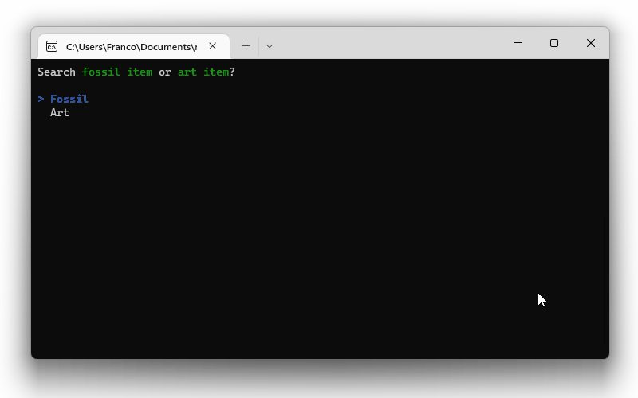
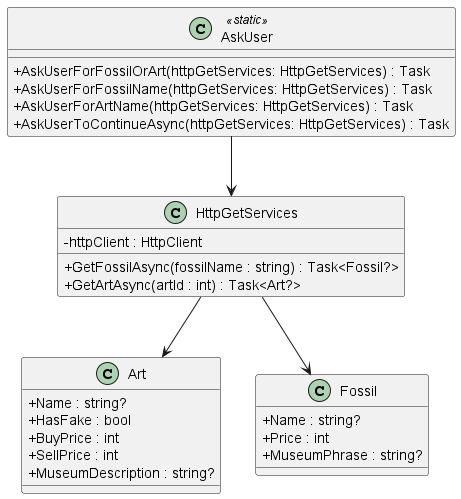

# Animal Crossing Game Store

This is a C# console application that uses the [Animal Crossing Web API](https://acnhapi.com/) to allow users to search for a:

1. a **fossil** by entering its name in the console
2. an **art** by entering its ID number in the console

# Instructions

**Prerequisite**: The machine running the application should have [.NET 6.0](https://dotnet.microsoft.com/en-us/download/dotnet/6.0) (or above) installed.

To run the application:

1. clone the repository to your computer
2. then navigate to the `AnimalGameStore` folder (with `cd` command or otherwise)
3. then run the following command

```c#
dotnet run
```

# App Demo



# UML Diagram


